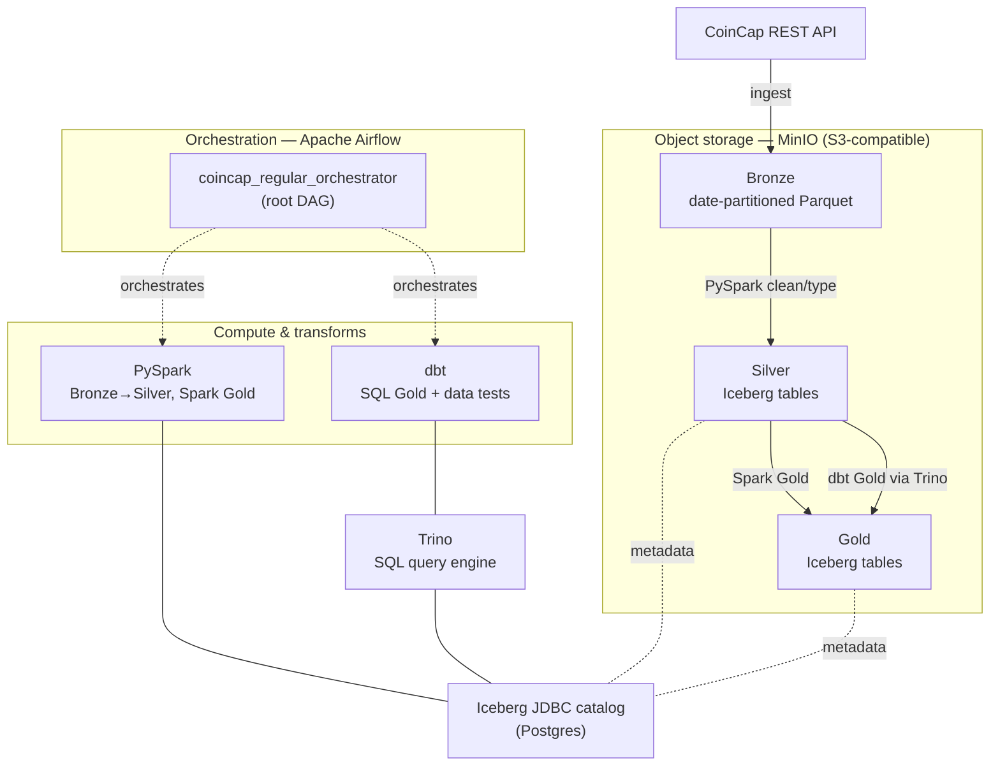

# Crypto Lakehouse — Local Bronze/Silver/Gold Batch Platform

A self-contained, local-first **lakehouse** that ingests cryptocurrency market data
and refines it through a medallion (Bronze → Silver → Gold) architecture. Everything
runs on Docker Compose — no cloud account required — using the same open-source
components you would reach for on a real platform: **Airflow, PySpark, Apache Iceberg,
MinIO, Trino, and dbt**.

It is a learning/portfolio project, but deliberately carries production-shaped
concerns: explicit date propagation, separated regular vs. backfill flows, retries,
idempotent single-date replays, data tests in the orchestrated path, and two parallel
Gold implementations (Spark and dbt) kept side by side for comparison.

> **What's next:** an AI-agent layer (MCP server + text-to-analytics agent over the Gold
> layer) is designed and about to be built as a new module. See the
> [Roadmap](#roadmap) and [`docs/new_ARCHITECTURE.md`](docs/new_ARCHITECTURE.md).

---

## Architecture



### Medallion flow

| Layer  | Format                     | Built by            | Modeling                         | Purpose                                   |
|--------|----------------------------|---------------------|----------------------------------|-------------------------------------------|
| Bronze | Parquet (date-partitioned) | Airflow + `requests`| None — source shape preserved    | Immutable landing zone / replay source    |
| Silver | Iceberg                    | PySpark             | Entity-centric (≈3NF)            | Clean, typed, deduplicated tables         |
| Gold   | Iceberg                    | PySpark **and** dbt | Analytical / dimensional         | Analysis-ready datasets                    |

Gold is intentionally built **twice**:

- **Spark Gold** → `gold.crypto.*`
- **dbt Gold** → `gold.crypto_dbt.*`

Keeping both lets you compare a DataFrame-API implementation against a SQL/dbt one on
identical inputs (see the comparison queries in [`docs/runbook.md`](docs/runbook.md)).

---

## Stack — and why each piece is here

- **Apache Airflow** — orchestration, scheduling, retries, and backfills; a first-class
  learning target, not just glue.
- **PySpark** — explicit DataFrame transforms for Bronze→Silver and one Gold path.
- **Apache Iceberg** — table format for Silver/Gold: schema evolution, snapshots, and
  time travel over object storage.
- **MinIO** — S3-compatible object storage; the lakehouse backing store for every layer.
- **Postgres** — Airflow metadata database and the Iceberg JDBC catalog.
- **Trino** — SQL engine that reads/writes Iceberg; the endpoint for dbt and ad-hoc queries.
- **dbt** — the SQL Gold path plus data tests, run against Trino inside the regular flow.

Concrete versions live in [`docker-compose.yml`](docker-compose.yml),
[`requirements.txt`](requirements.txt), and [`docs/architecture.md`](docs/architecture.md).

---

## Quick start

**Prerequisites:** Docker Desktop (with Compose v2). On Windows the helper scripts use
PowerShell; a `Makefile` mirrors the same commands elsewhere.

1. **Start the stack.** On first run this copies `.env.example` → `.env` and stops so you
   can fill in real values:

   ```powershell
   .\scripts\stack.ps1 up
   ```

   Edit `.env` and replace every `REPLACE_WITH_...` placeholder — Airflow admin
   credentials and Fernet key, Postgres/MinIO passwords, `COINCAP_API_KEY`, and
   `JUPYTER_TOKEN`. (`.env` is gitignored; only `.env.example` is committed.)

2. **Start it again** once `.env` is ready. Use `-Rebuild` after Dockerfile or dependency
   changes:

   ```powershell
   .\scripts\stack.ps1 up            # or: .\scripts\stack.ps1 up -Rebuild
   ```

3. **Open the services:**

   | Service         | URL                     |
   |-----------------|-------------------------|
   | Airflow         | http://localhost:8080   |
   | MinIO console   | http://localhost:9001   |
   | Trino           | http://localhost:8081   |
   | JupyterLab      | http://localhost:8888   |

4. **Stop the stack** (volumes preserved; add `-Volumes` to also delete local data):

   ```powershell
   .\scripts\stack.ps1 down          # or: .\scripts\stack.ps1 down -Volumes
   ```

Short aliases exist: `.\scripts\start.ps1` and `.\scripts\stop.ps1`. The `Makefile`
provides equivalents (`make up`, `make down`, `make ps`, `make logs-scheduler`, …).

> **Verification note:** the scripts, service URLs, and port mappings above were checked
> against [`scripts/stack.ps1`](scripts/stack.ps1) and [`docker-compose.yml`](docker-compose.yml).
> The one thing this README does **not** verify is a live end-to-end pipeline run — that
> requires a valid `COINCAP_API_KEY` and a full `docker compose up`, which are
> environment-specific.

---

## Running the pipeline

The normal entrypoint is a single root DAG that fans out to the leaf DAGs:

- **`coincap_regular_orchestrator`** triggers, in order:
  1. `bronze_coincap_assets`
  2. `silver_coincap_assets`
  3. `gold_coincap_assets` **and** `gold_dbt_coincap_assets` (in parallel)
  4. `gold_dbt_coincap_tests` (after the dbt Gold build succeeds)

Use it for scheduled daily processing and for manual single-date reruns (set
`target_date` to `YYYY-MM-DD`). The leaf DAGs stay useful for isolated debugging and
targeted replays. **Backfills** are deliberately separate and manual
(`bronze_coincap_history_backfill`, `silver_coincap_history_backfill`).

Full operating procedures, single-layer replay steps, and validation queries are in the
[runbook](docs/runbook.md).

### dbt workflow (on the host)

```powershell
dbt debug --project-dir dbt --profiles-dir dbt
dbt run   --project-dir dbt --profiles-dir dbt --select daily_snapshot mc_rank_change wkly_roll_avg --vars '{"snapshot_date": "2026-04-02"}'
dbt test  --project-dir dbt --profiles-dir dbt --select daily_snapshot mc_rank_change wkly_roll_avg --vars '{"snapshot_date": "2026-04-02"}'
```

Inside Airflow the same build and tests run as the two downstream dbt DAGs. See
[`dbt/README.md`](dbt/README.md).

---

## Repository layout

| Path                    | Contents                                                        |
|-------------------------|-----------------------------------------------------------------|
| [`dags/`](dags)         | Airflow DAG definitions (orchestrator, leaf DAGs, backfills)     |
| [`spark/`](spark)       | PySpark transforms and helper modules                           |
| [`dbt/`](dbt)           | dbt project for the SQL Gold path and data tests                |
| [`config/`](config)     | Trino catalog/service configuration                             |
| [`tests/`](tests)       | DAG-integrity, schema, and transform unit tests (pytest)        |
| [`notebooks/`](notebooks)| JupyterLab exploration of the lakehouse                        |
| [`scripts/`](scripts)   | PowerShell helpers for running the stack                        |
| [`docs/`](docs)         | Architecture, decisions, runbook, milestones                    |

---

## Documentation map

- [architecture.md](docs/architecture.md) — system overview and layer design
- [decisions.md](docs/decisions.md) — technical decision log
- [runbook.md](docs/runbook.md) — operating procedures and debugging by symptom
- [table_browser.md](docs/table_browser.md) — exploring tables via Trino / Jupyter / dbt
- [milestones.md](docs/milestones.md) — how the project was built up, milestone by milestone
- [new_ARCHITECTURE.md](docs/new_ARCHITECTURE.md) — design for the upcoming AI-agent layer
- [dbt/README.md](dbt/README.md) — dbt-specific setup and usage

---

## Roadmap

The platform above is stable. The next track adds an **AI-agent layer** on top of the
Gold layer, designed in [`docs/new_ARCHITECTURE.md`](docs/new_ARCHITECTURE.md) (the source
of truth for that work). It extends the platform without modifying any existing pipeline:

- **Phase A — MCP server + text-to-analytics agent.** A transport-agnostic MCP server
  exposes governed, read-only Gold-layer tools (schema, lineage, dbt docs, guarded
  `execute_query`); a bounded-state-machine agent turns natural-language questions into
  validated SQL with a confidence gate that refuses rather than guesses. Includes an eval
  harness scored on execution accuracy.
- **Phase B — RAG over catalog & lineage docs.** An Airflow DAG that chunks and embeds
  dbt/Iceberg catalog metadata into a vector store, surfaced to the agent as a
  `search_catalog` tool (sketch; open questions documented).
- **Phase C — Feature-store bridge (Feast).** A thin Feast bridge reading Gold Iceberg
  tables through Trino, with feature definitions derived from existing dbt models (sketch).

The scaffolding for Phase A lives under [`ai_agent/`](ai_agent) — a README stub today,
implementation to follow.

---

## Notes

- **Local-first.** Cloud equivalents (S3, Glue/REST catalog, EMR, MWAA) are documented in
  [architecture.md](docs/architecture.md) but nothing here requires cloud access.
- **Data may need replay** if you change catalog configuration or DAG contracts.
- **License:** [MIT](LICENSE).
