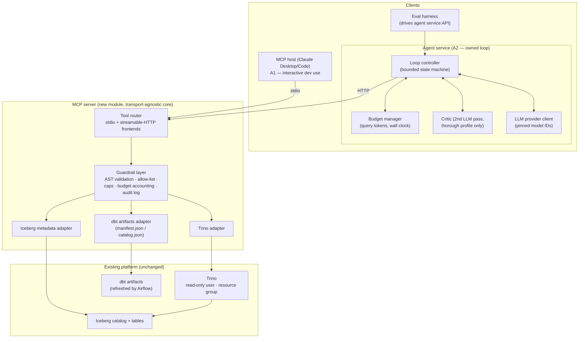
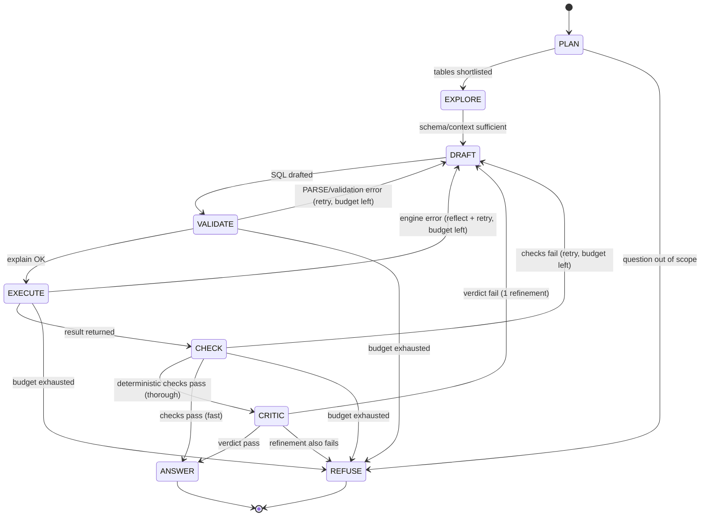

# AI-Agent Layer on the Lakehouse — Architecture

**Status:** Design accepted · **Scope:** New module in the existing lakehouse repo. Extends (never modifies) the running Bronze/Silver/Gold platform: Airflow, PySpark, Iceberg, dbt, Trino on Docker.

One track, three phases. Phase A is designed in full depth; Phases B and C are sketches with open questions.

---

## 1. Requirements & Constraints (locked positions)

These were interrogated and fixed before design. Each maps to Decision Log entries (§8).

| # | Position |
|---|----------|
| R1 | Two clients, staged: **A1** = commodity MCP host (Claude Desktop/Code) over stdio; **A2** = custom agent service over HTTP. Same server, transport-agnostic core. |
| R2 | Threat model: **fallible LLM, single trusted human**. Guardrails cap blast radius of bad generated SQL — no adversarial-user assumptions. (Revisit triggers in §8, D11.) |
| R3 | Wrongness posture: **confidence-gated — refuse rather than answer when checks fail**. Refusals always show best-effort SQL and the reason. |
| R4 | **One loop, two budget profiles** (`fast` ⊆ `thorough`), not two designs. `fast`: ≤3 queries, 1 retry, deterministic checks only, ~30 s. `thorough`: ~10 queries, ≤3 retries, + critic pass, ~2 min. |
| R5 | Confidence is manufactured by **deterministic checks + LLM critic pass** (thorough profile). |
| R6 | Data scope: **Gold layer only**, via explicit allow-list. Silver/Bronze invisible to the agent. |
| R7 | Eval ground truth: **hand-written golden set of NL→SQL→result triples**, scored on execution accuracy. Thorough-profile accuracy is the headline number; fast is reported as a speed/accuracy delta. |
| R8 | LLM runtime: **hosted API** (Claude), model IDs pinned and recorded in every eval report. Thin provider interface for smoke-testing with a local model — eval infrastructure, not speculative generality. |
| R9 | Agent is **one-shot and stateless** per question. Conversational follow-ups are explicitly out of scope for Phase A. |
| R10 | Guardrail placement: **tool layer is primary enforcement; Trino engine is a dumb backstop; prompt layer is advisory only** and documented as non-enforcing. |

---

## 2. Phase A — System Overview

### 2.1 Component diagram

### 2.2 Boundaries

- **MCP server** owns everything between "tool call arrives" and "governed result returns": validation, caps, budget accounting, audit. It is LLM-agnostic and knows nothing about questions or answers.
- **Agent service** owns question understanding, the loop, SQL drafting, the confidence gate, and the final answer. It holds no enforcement power — it can only ask the server nicely.
- **Existing platform** is a dependency, never a subject of change. The only platform-side additions are configuration: a read-only Trino user and a resource group (backstop, §4), and an Airflow step that publishes fresh dbt artifacts where the server reads them.
- **Schema truth:** live Iceberg metadata is authoritative for structure; dbt docs are annotation. When they disagree (stale manifest), the agent trusts Iceberg and the disagreement is surfaced as a warning, not an error.

---

## 3. Phase A — Tool Inventory & Contracts

All tools return either a typed result or a **structured error**: `{code, message, retryable, hint}`. Error codes: `PARSE_ERROR`, `NOT_READ_ONLY`, `TABLE_NOT_ALLOWED`, `BUDGET_EXCEEDED`, `TIMEOUT`, `ENGINE_ERROR`. The agent loop's reflect/retry behavior keys off `code` and `retryable` — this contract is what makes the loop designable at all.

Cost classes: **free** (server-side metadata, no engine work, no budget charge), **cheap** (engine planning, small budget charge), **expensive** (engine scan, full budget charge + full guardrail path).

| Tool | Input | Output | Cost |
|------|-------|--------|------|
| `list_tables` | optional tag/schema filter | `[{table, description, tags, approx_rows}]` — allow-listed Gold tables only; descriptions from dbt docs | free |
| `get_table_schema` | `table` | columns `{name, type, comment, nullable}`, partition spec, sort order, stats `{row_count, size_bytes, last_updated}` — from live Iceberg metadata | free |
| `get_table_snapshots` | `table, limit` | snapshot history `{snapshot_id, committed_at, operation, summary}` — powers freshness caveats in answers | free |
| `get_lineage` | `model, direction, depth` | upstream/downstream models and sources from dbt manifest | free |
| `get_model_docs` | `model` | dbt description, column docs, tests defined | free |
| `sample_rows` | `table, n (≤20)` | `n` rows — exploration sugar with a hard cap, so the guardrails can treat it more cheaply than arbitrary SQL | cheap |
| `explain_query` | `sql` | plan summary + validation verdict, **no scan** — the loop's pre-execution validity check | cheap |
| `execute_query` | `sql, max_rows?` | `{columns, rows, truncated: bool, stats: {rows_read, bytes_read, elapsed_ms}, query_id}` | expensive |

Contract notes that matter:

- `execute_query` **always** returns `truncated` and scan stats. Truncation must reach the final answer as a caveat — a truncated result presented as complete is a silent-wrongness failure mode (§7, F9).
- Every `execute_query`/`sample_rows` call is written to an **audit log** (SQL, validation verdict, stats, timestamp, client) before results return. Under R2 this is a debugging/eval instrument, not a compliance one — but it becomes the compliance instrument if R2 ever changes.
- The server is stateless per call except budget accounting, which is scoped to a client-supplied `request_id` (one NL question = one request_id = one budget).

---

## 4. Phase A — Guardrail Spec

Three layers with explicitly different jobs (Decision D4). The tool layer is rich and semantic; the engine layer is dumb and unbypassable; the prompt layer steers but enforces nothing.

| Control | Layer | Mechanism | What it stops |
|---------|-------|-----------|---------------|
| Read-only SQL | Tool | AST parse (Trino dialect); statement-type whitelist: single `SELECT` only. No DDL/DML, no `EXECUTE`, no `SET SESSION`, no multi-statement | Writes, session tampering, stacked statements |
| Table allow-list | Tool | Extract all referenced tables from AST (post-qualification, including CTE-shadowing resolution); every one must be in the Gold allow-list | Access to Silver/Bronze/system tables |
| Row cap | Tool | Inject/lower `LIMIT` to configured max; set `truncated` flag when hit | Result floods into the LLM context |
| Scan/cost cap | Tool | Per-query timeout; bytes-read abort via query stats polling | Runaway scans on a laptop-class stack |
| Query budget | Tool | Token bucket per `request_id`; `fast`=3, `thorough`=10; exhaustion → `BUDGET_EXCEEDED` | Unbounded agent loops |
| Read-only user | Engine | Trino user with SELECT-only grants on Gold catalog/schema | Anything a tool-layer parser bug lets through |
| Resource group | Engine | Trino resource group: max run time, memory, concurrency | Runaway queries that dodge tool-layer caps |
| Behavioral steering | Prompt | System-prompt scope rules ("only answer from available tables", "always cite SQL") | Nothing — advisory only, and the doc says so |

Design stance worth defending: the AST validator is the **primary** control because it is deterministic, unit-testable, and LLM-independent — you can prove properties about it that you cannot prove about a prompt. The engine backstop exists because the validator is code and code has bugs; a `CREATE TABLE` that somehow survives parsing dies at the grant check. Defense in depth, with each layer catching a different failure class.

---

## 5. Phase A — Agent Loop Design

A **bounded state machine with LLM decisions inside states** — not a fixed DAG, not a free-running ReAct loop (Decision D3).

**States.** `PLAN`: classify the question, shortlist tables via `list_tables` + `get_model_docs`; refuse immediately if Gold can't plausibly answer it. `EXPLORE`: `get_table_schema` (free), `sample_rows` only when value formats are genuinely ambiguous. `DRAFT`: generate SQL with schema + docs in context. `VALIDATE`: `explain_query` — catches syntax/semantic errors without spending a scan. `EXECUTE`: `execute_query`. `CHECK` (deterministic): execution succeeded; result non-empty when the question implies data should exist; column count/types plausible for the question shape; truncation noted. `CRITIC` (thorough only): second LLM call with `{question, sql, result_sample, schemas_used}` → `{verdict: pass|fail, reason}`; a fail buys exactly one refinement attempt, then refusal.

**Terminal contract.** Every terminal state emits the same envelope: `{answer | refusal_reason, sql, tables_used, result_stats, caveats[], confidence: passed_checks[], profile, request_id}`. SQL is shown in every outcome including refusal (R3) — the user is never asked to trust an invisible query.

**Budget profiles (R4).** One code path; `thorough` is a strict superset (adds critic + more retry tokens). The budget manager, not the LLM, decides when the loop stops: exhaustion forces a terminal state. This is the property a free ReAct loop can't give you and the reason the state machine exists.

**Statelessness (R9).** Each question starts cold. Schema exploration results are cacheable server-side (they're deterministic reads), so "cold" costs metadata calls, not scans.

---

## 6. Phase A — Eval Harness

**Ground truth (R7).** A hand-written golden set (target 30–50 cases) over the actual Gold tables. Two subsets, both essential:

- **Answerable**: `{question, reference_sql, expected_result}` — scored on **execution accuracy**: result-set equivalence under normalization (order-insensitive unless the question demands ordering, float tolerance, column-name-insensitive). Never SQL string match — many SQLs are correct.
- **Unanswerable**: questions Gold cannot answer (missing entity, wrong grain, data that lives only in Silver). Correct behavior is **refusal**. Without this subset the confidence gate is untested in the direction that matters.

**Metrics.**

| Metric | Definition | Role |
|--------|-----------|------|
| Execution accuracy (thorough) | correct results / answerable set | Headline number |
| Fast-mode delta | thorough accuracy − fast accuracy, and latency ratio | The price of speed — a result in itself |
| Over-refusal rate | refusals / answerable set | The cost of the gate |
| Refusal catch rate | refusals / unanswerable set | The value of the gate |
| Efficiency | queries, wall time, tokens per question | Budget realism check |
| Stability | accuracy variance across 3 runs, temperature 0 | Separates model noise from architecture |

**Mechanics.** The harness drives the **agent service API** directly (not through an MCP host — A1's loop is a black box, which is exactly why A2 exists). Every report records: model ID, prompt version, allow-list hash, golden-set version, profile. A result that can't be tied to those five pins is not a result.

**Rejected alternative:** LLM-as-judge as the primary scorer — judge bias makes the accuracy number indefensible in review. A judge may later *extend* coverage over unlabeled questions, but the golden set remains the metric of record.

---

## 7. Phase A — Failure Modes

| # | Failure | Effect | Detection | Mitigation |
|---|---------|--------|-----------|------------|
| F1 | Plausible-but-wrong SQL executes fine | Silent wrong answer — the headline risk | Critic pass; golden-set accuracy; SQL always shown | Confidence gate (R3/R5); refusal over guessing |
| F2 | Critic false-pass | Wrong answer sails through the gate | Only visible in evals | Track critic precision on golden set; caveats + SQL shown remain the last line |
| F3 | Critic false-fail | Over-refusal, wasted budget | Over-refusal rate metric | One refinement attempt before refusing; tune critic prompt against eval data |
| F4 | Runaway/expensive query | Local stack starved | Scan-stats polling; timeout | Tool-layer caps; Trino resource group backstop |
| F5 | Allow-list bypass via AST parser bug | Agent reads outside Gold / attempts write | Engine grant denial in audit log | Read-only Trino user (D4); parser unit tests as gate |
| F6 | Stale dbt artifacts vs live schema | Agent drafts SQL against a column that moved | Schema mismatch at VALIDATE | Iceberg is schema truth (§2.2); Airflow refreshes artifacts post-run |
| F7 | Trino / MCP server down | No answers possible | Structured `ENGINE_ERROR`, non-retryable | Agent refuses with infrastructure reason — never fabricates from memory |
| F8 | LLM provider outage or model drift | Loop stalls; eval numbers shift silently | Pinned model IDs; eval re-baseline on any change | Provider interface allows fallback; drift is re-baselined, never averaged over |
| F9 | Truncated result read as complete | Subtly wrong aggregates/answers | `truncated` flag in contract | Flag propagates to answer caveats, mandatorily |
| F10 | Budget exhausted mid-loop | No answer produced | `BUDGET_EXCEEDED` | Forced terminal state: refusal with partial work shown |
| F11 | Prompt injection via dbt docs / table contents | Hijacked agent behavior | Not defended today | **Accepted risk under R2** — becomes real the moment free-text retrieval lands (Phase B). Revisit trigger in D11 |

---

## 8. Decision Log

Format: **Decision → Alternatives considered → Why → Revisit when.**

**D1 — Expose the lakehouse via MCP, not a bespoke API.**
Alternatives: custom REST/gRPC service; direct LLM function-calling against ad-hoc endpoints.
Why: MCP gives a standardized tool-discovery and invocation contract, so one server serves both a commodity host (A1) and the custom agent (A2) with zero client glue; a bespoke API reinvents tool schemas and buys nothing at this scale.
Revisit when: the agent needs streaming partial results or bulk data movement beyond MCP's request/response sweet spot.

**D2 — Transport: stdio for A1, streamable HTTP for A2; transport-agnostic core.**
Alternatives: HTTP-only from day one; SSE transport.
Why: stdio is zero-infra for a local desktop host and ships A1 fastest; HTTP is required for service-to-service concurrency in A2. Keeping the core transport-agnostic makes this a frontend concern, not a fork. SSE is superseded in the MCP spec direction.
Revisit when: A1 is retired, or a remote/multi-user deployment makes stdio irrelevant.

**D3 — Agent loop: bounded state machine, not fixed DAG, not free ReAct.**
Alternatives: static pipeline (classify → generate → execute → answer); unconstrained tool-calling loop.
Why: a fixed DAG can't adapt exploration depth to question difficulty; a free loop can't be budgeted, evaled, or reasoned about — its termination is a hope. The state machine keeps LLM judgment inside states while the budget manager owns termination.
Revisit when: eval data shows question types needing plan shapes the state machine can't express (e.g., multi-query decomposition as a first-class plan).

**D4 — Guardrails: tool layer primary, engine backstop, prompt advisory.**
Alternatives: prompt-only ("please only SELECT"); engine-only (grants + resource groups, no server validation); tool-layer-only (original position, revised in review).
Why: the tool layer is deterministic, unit-testable, and gives the agent *structured, actionable* errors — the engine just says "denied." But the validator is code with bugs, so the engine's read-only user is the unbypassable floor. Prompts steer; they do not enforce, and the doc says so explicitly.
Revisit when: multi-user access arrives (engine layer must grow per-user authz), or the validator's language coverage is proven complete enough to argue the backstop is redundant (it won't be).

**D5 — Confidence gate: deterministic checks + LLM critic; refuse on failure.**
Alternatives: always answer with caveats; self-consistency voting (N candidates, compare results); deterministic checks only.
Why: silent wrongness is the failure mode that matters (F1); deterministic checks catch structural wrongness cheaply, the critic catches semantic mismatch. Self-consistency was rejected on cost (N× executions per question) and murky disagreement semantics. Pure always-answer was rejected as the posture, but its honesty survives in the contract: refusals still show SQL and reasoning.
Revisit when: eval shows critic precision too low to justify its latency/cost (fold back to checks-only), or over-refusal rate exceeds what a working analyst would tolerate (~10%+).

**D6 — One loop, two budget profiles (`fast` ⊆ `thorough`), not two modes.**
Alternatives: two independently designed paths; single profile.
Why: a superset relationship keeps one code path, one eval story, and turns the profile difference into a measurable speed/accuracy delta instead of a maintenance fork.
Revisit when: the delta measured in evals is negligible (kill `fast`) or enormous (question whether `fast` is fit for any use).

**D7 — Data scope: Gold only, explicit allow-list.**
Alternatives: Gold + Silver; everything readable with a deny-list.
Why: Gold is curated, documented, and business-grain — a small schema surface is the single cheapest accuracy lever in text-to-SQL. Allow-lists fail closed; deny-lists fail open.
Revisit when: golden-set analysis shows a class of legitimate questions Gold structurally cannot answer — the fix may be a new Gold model, not a wider agent scope.

**D8 — Eval: golden-set execution accuracy as metric of record.**
Alternatives: LLM-as-judge primary; SQL string/AST match.
Why: execution accuracy is objective and defensible cold; string match punishes correct SQL written differently; judge-primary makes the headline number a function of judge bias. Unanswerable cases are first-class — they are the only way to eval the refusal gate in the direction that matters.
Revisit when: golden-set maintenance cost outgrows its value, or question volume justifies judge-extended coverage on top (never instead).

**D9 — LLM runtime: hosted API, pinned models, thin provider interface.**
Alternatives: local model (all-Docker purity); hard-wired single provider.
Why: SQL-generation quality dominates every metric this project reports; a weak local model would make the evals measure the model, not the architecture. Pinning model IDs in eval reports is what keeps numbers comparable. The provider interface exists for cheap smoke tests, justified as eval infrastructure.
Revisit when: local models reach near-parity on SQL benchmarks, or API cost of eval runs becomes the binding constraint.

**D10 — Stateless one-shot agent.**
Alternatives: conversational with dialog history from day one.
Why: statelessness keeps the answer envelope self-contained, the evals single-turn, and eliminates the "wrong because of stale context" failure class entirely. Follow-ups are a backlog item with a clean insertion point (context becomes an input to `PLAN`).
Revisit when: real usage shows a majority of questions are refinements of the previous one.

**D11 — Threat model: fallible LLM, single trusted user.**
Alternatives: assume prompt injection via data; assume untrusted users.
Why: honest scoping — hardening against adversaries who don't exist buys complexity, not safety. The blast-radius controls (D4) are what this threat model actually requires.
Revisit when — explicit triggers: (a) any tool starts returning free-text retrieved at runtime (Phase B RAG chunks, richer dbt-doc surfacing) → injection-via-data becomes real; (b) a second human user → authz, per-user audit, and the engine layer grows teeth; (c) write-capable tools of any kind → full redesign of the guardrail spec, not an amendment.

---

## 9. Phase B — Sketch: RAG over Catalog & Lineage Docs

RAG here is a **pipeline, not a service bolted on**: an Airflow DAG (same orchestrator, same repo idiom) that chunks dbt docs, model/column descriptions, lineage relationships, and Iceberg table metadata; embeds them; and loads a vector store — exposed to the agent as one new MCP tool (`search_catalog(query, k)`) that feeds the `PLAN` state, replacing brute-force `list_tables` scans when the catalog outgrows the context window. Storage trade-off as currently seen: **pgvector** wins on ops (Postgres already runs for Airflow; catalog-scale corpora are thousands of chunks, not millions — ANN sophistication is wasted here); a **dedicated vector DB** (Qdrant et al.) is capability the corpus doesn't justify; **embeddings-in-Iceberg** is philosophically attractive (one storage layer, versioned corpus) but Trino has no credible ANN story, so retrieval would be brute-force scans — plausible at this scale, worth a spike before dismissing.

Top 3 open questions:
1. **Does retrieval beat context-stuffing at all at this catalog size?** If the full Gold schema + docs fits in the model context, RAG adds a retrieval-miss failure mode and buys nothing. Measure before building.
2. **Chunk granularity and refresh semantics** — model-level vs column-level chunks; full rebuild vs incremental on each dbt run; how staleness is detected and surfaced.
3. **Injection surface** — retrieved free text enters the prompt verbatim; this is the D11(a) trigger firing. What sanitization/quoting discipline applies before Phase B ships?

## 10. Phase C — Sketch: Feature-Store Bridge (Feast)

A thin bridge, not a platform: Feast repo defined alongside dbt, with the **offline store reading Gold Iceberg tables through Trino** (community Trino offline-store support exists — its maturity is the load-bearing question), a minimal online store, and feature definitions deliberately derived from existing Gold models rather than a parallel transformation path — dbt stays the single place transformations live. The bridge connects to prior SageMaker inference work: training reads point-in-time-correct features offline; the endpoint reads the same definitions online. Agent-facing surface is small: MCP tools for feature metadata ("what features exist for entity X, from which models, how fresh") and possibly governed point lookups — the agent explains and audits the feature store; it does not serve production inference traffic.

Top 3 open questions:
1. **Is Feast's Trino/Iceberg offline path production-grade**, or does it quietly force a Spark dependency that duplicates the existing PySpark layer?
2. **Definition ownership** — features defined in Feast vs derived from dbt models: where is the single source of truth, and what prevents drift between the two repos?
3. **Does the online store earn its ops cost** for this use case, or is offline + batch scoring (the existing SageMaker pattern) sufficient — and what does training/serving skew monitoring look like either way?

---

## Appendix — Defense Crib (one-liners for review)

- *Why MCP and not a REST API?* One standardized contract, two clients for free; REST buys nothing but glue code. (D1)
- *Why a state machine and not "just let the agent loop"?* Because termination and budget must be properties of the system, not hopes about the model. (D3)
- *Why don't prompts count as guardrails?* Prompts steer a fallible component; enforcement must sit where the fallible component can't reach it. (D4)
- *Why refuse instead of always answering?* Silent wrongness is the failure mode; refusal-with-SQL-shown converts it into a visible, evaluable event. (D5)
- *Why is the eval trustworthy?* Execution accuracy on a pinned, versioned golden set — including unanswerable cases that test the gate in the direction that matters. (D8)
